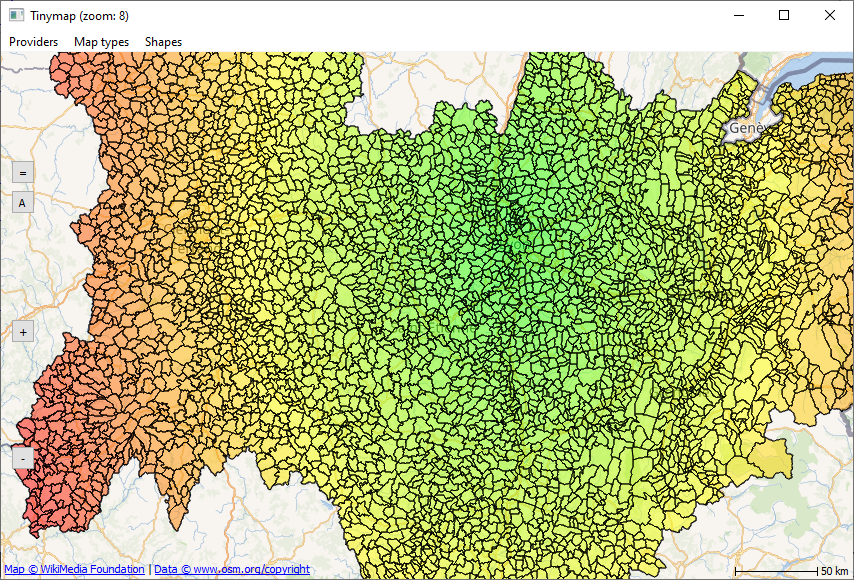
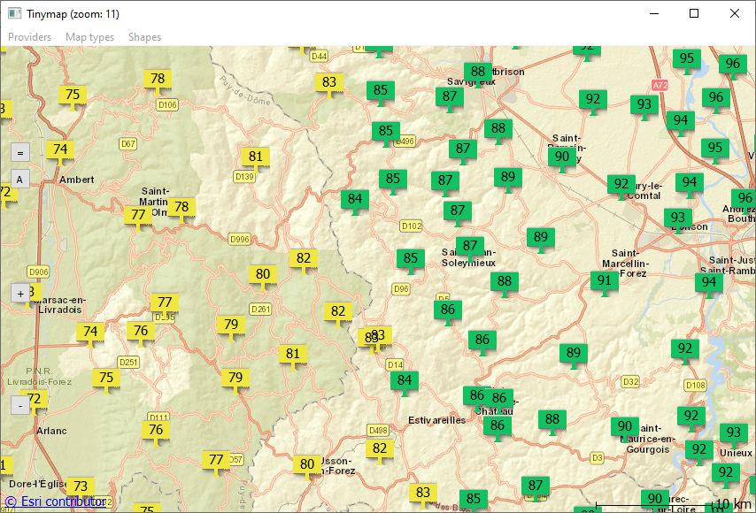

# tinymap
The tinymap project allows to display a map of the Earth, using the Qt framework, with the capability to overlay interactive 
objects tied to the map's surface. The operation is similar to Qml Map object. 
The geographic region displayed in the CMapCtrl is defined by the properties center, and zoomLevel.
The center property contains a coordinate specifying the center of the map while zoomLevel controls the scale of the map.

When the map is displayed, each visible geographic coordinate, using WGS84 coordinate system (latitude et longitude in degree),
will map to some pixel X and Y coordinate on the screen.
To perform conversions between these two, Map provides `coordinatesToWidget` and `widgetToCoordinates` functions, 
which are of general utility.
Another usefull utility is the capabilty to interact with objects.
- The dynamic picking allows the user to change the color, to display a tool tip, ...) when the cursor flies over the object.
- The static picking allow the user to activate functions when the user click on the object.

## Why create a new control in place of Qml Map
I recently published a project on GitHub to visualize air pollution in France (see https://github.com/ptstream/aqic).
This project makes it possible to visualize the air quality index of all cities of a region of France at a given time.
The maps are displayed using the Map type of Qml. I noticed that it loads the memory very very heavily.
I therefore developed a tool, probably less sophisticated but much less memory intensive and sufficient
to make a more acceptable version of aqic. 

### Main advantages:
- Extremely lighter in memory espacially for big number of interactive objects.
- Run on WebAssembly (Qml Map generates various errors with browsers).
- Do not use Qml and Java script just C++.
- Can be build for float or double.
- The map is displayed by a classical QWidget.
- QtLocation on Qt 6 not available actually.

### Main disavantages
- Much less possibilities than Qml Map.
- The zoom level step is limited at integer values (e.g. [0,1,2,3,..]).
- A little slower (Not use OpenGL to run without restriction on WebAssembly).
- Actually limited at OSM and ESRI.
- 2D only.

## Map Objects
A set of map objects can be added to the map. The objects are devides into two groups.
1. Objects requiring a positioning point with a look independent of zoom.
  - Crosses. It is the representation of a simple point.
  - Images
  - texts
  
1. Objects that depend on zoom. Only polygons are filled by the current brush.
   - Circles
   - Polygons
   - polylines

## Development notes
1. tinymap is coded in C++ and has been tested with the framework Qt5.15.2 available at https://www.qt.io/.

2. Compilers tested.
   - Windows. Mingw81_64 and Msvc2015_64.
   - Linux. GCC 9.3.0.
   - MacOS. The tool chain LLMV 10.0.1 with Clang 1001-0-46-4.
   - WebAssembly. The tool chain emscripten (see Qt documentation for compatible version).
     Launch WebAssembly project is not possible from QtCreator.
	 On Windows, use `wasm.cmd`, on Linux use `wasm.sh`,  after environment variables adjustment and the port number.
     Tinymap under WebAssembly has been tested using Python web server with Firefox, Edge, Opera, Chrome.
  
3. Three static libaries are created 
   - tools defines the general functions not using Qt.
   - mapctrl is the map widget manager and the map objects.
   - town is a library used only by sample.
   
## sample
A sample program allows to test the CMapWidget object.
The data consists of a widget to display the map and a list of town contours of the region "Auvergne Rhône Alpes" of France.
The objects tied on the map (polygon, polyline) use the contours of towns. 
The other objects (circle, cross, image, text) are positionned at the centroid of polygons.
The colors depend of the "distance" between the city "Lyon" and the other cities.
It is possible to change the provider and/or the type of the map.
Some simple commands (buttons at left of the map) allow the user to center the map on "Lyon" (=), fit in view the objects (A),
zoom in (-) and zoom out (+). The mouse left button allows also to change the center position and the scroll wheel the zoom.

## License
This code is free software: you can redistribute it and/or modify
it under the terms of the GNU General Public License as published by
the Free Software Foundation, either version 3 of the License, or
(at your option) any later version.

It is distributed in the hope that it will be useful,
but WITHOUT ANY WARRANTY; without even the implied warranty of
MERCHANTABILITY or FITNESS FOR A PARTICULAR PURPOSE.  See the
GNU General Public License for more details.

For details about the license see LICENSE and license.txt files.

